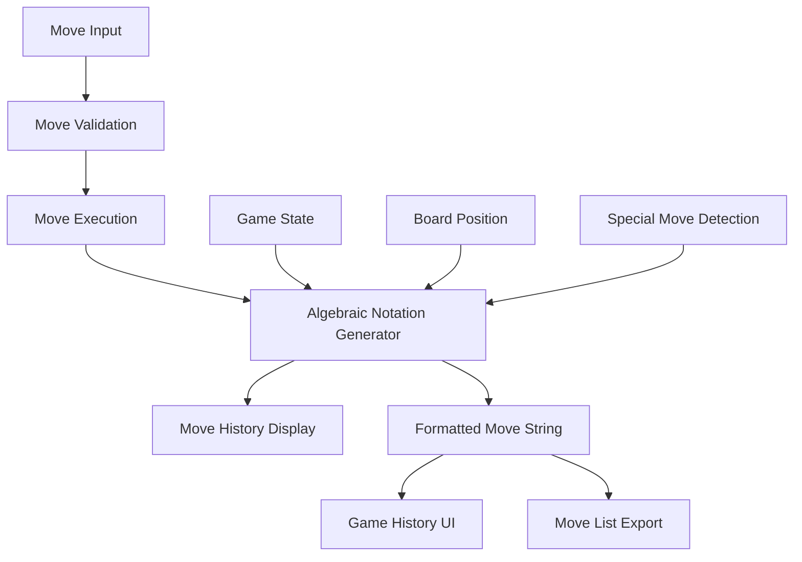

# Design Document

## Overview

The algebraic chess notation system will enhance WebChess by implementing standard algebraic notation (SAN) for move display and game history. This system will generate proper chess notation like "1. e4 e5 2. Nf3 Nf6 3. d4 exd4 4. e5 Ne4 5. Qxd4 d5 6. exd6 e.p." while maintaining backward compatibility with the existing coordinate-based move system.

The design follows a non-breaking approach where the existing move input/validation system remains unchanged, but move display and history generation will use proper algebraic notation.

## Architecture

### Core Components



### Integration Points

The algebraic notation system integrates with existing components:

1. **ChessGame Class**: Enhanced with notation generation methods
2. **GameStateManager**: Extended to include algebraic notation in move history
3. **Move History**: Augmented with both coordinate and algebraic formats
4. **UI Display**: Updated to show algebraic notation to users

## Components and Interfaces

### AlgebraicNotationGenerator Class

```javascript
class AlgebraicNotationGenerator {
  constructor(chessGame) {
    this.game = chessGame;
  }

  // Main notation generation method
  generateMoveNotation(move, gameState) {
    // Returns: { algebraic: "Nf3", coordinate: "Ng1-f3" }
  }

  // Specialized notation methods
  generatePawnNotation(move, isCapture, isPromotion, promotionPiece) {}
  generatePieceNotation(piece, move, isCapture, disambiguation) {}
  generateCastlingNotation(move) {}
  generateEnPassantNotation(move) {}
  
  // Disambiguation logic
  calculateDisambiguation(piece, fromSquare, toSquare, gameState) {}
  
  // Check/mate detection for notation
  addCheckMateNotation(baseNotation, gameState) {}
}
```

### Enhanced Move History Structure

```javascript
// Extended move object in history
{
  // Existing coordinate data (preserved)
  from: { row: 6, col: 4 },
  to: { row: 4, col: 4 },
  piece: { type: 'pawn', color: 'white' },
  
  // New algebraic notation data
  notation: {
    algebraic: "e4",           // Standard algebraic notation
    coordinate: "e2-e4",       // Legacy coordinate notation
    fullAlgebraic: "1. e4",    // With move number for display
    san: "e4"                  // Pure SAN without move numbers
  },
  
  // Enhanced move metadata
  moveType: "normal|capture|castling|enpassant|promotion",
  specialMarkers: ["e.p."|"O-O"|"O-O-O"|"=Q"|"+"|"#"],
  
  // Existing fields preserved...
  moveNumber: 1,
  timestamp: 1234567890,
  gameStateSnapshot: { ... }
}
```

### Game History Formatter

```javascript
class GameHistoryFormatter {
  // Format complete game in algebraic notation
  formatGameHistory(moveHistory) {
    // Returns: "1. e4 e5 2. Nf3 Nf6 3. Bc4 Bc5"
  }
  
  // Format partial sequences
  formatMoveSequence(moves, startMoveNumber) {}
  
  // Export formats
  exportPGN(gameMetadata, moveHistory) {}
  exportAlgebraicList(moveHistory) {}
}
```

## Data Models

### Notation Configuration

```javascript
const NotationConfig = {
  pieceSymbols: {
    king: 'K',
    queen: 'Q', 
    rook: 'R',
    bishop: 'B',
    knight: 'N',
    pawn: ''  // No symbol for pawns
  },
  
  specialMarkers: {
    capture: 'x',
    check: '+',
    checkmate: '#',
    kingsideCastle: 'O-O',
    queensideCastle: 'O-O-O',
    enPassant: ' e.p.',
    promotion: '='
  },
  
  files: 'abcdefgh',
  ranks: '87654321'  // Display ranks (row 0 = rank 8)
};
```

### Disambiguation Rules

```javascript
const DisambiguationRules = {
  // When multiple pieces can reach same square
  SAME_TYPE_CONFLICT: 'file',      // Try file first (Nbd2)
  FILE_INSUFFICIENT: 'rank',       // Then rank (N1f3)  
  RANK_INSUFFICIENT: 'full',       // Finally full square (Qd1d4)
  
  // Priority order for disambiguation
  PRIORITY: ['file', 'rank', 'full']
};
```

## Error Handling

### Notation Generation Errors

```javascript
const NotationErrors = {
  INVALID_MOVE_DATA: 'Move data incomplete for notation generation',
  AMBIGUOUS_MOVE: 'Cannot resolve move disambiguation',
  INVALID_SPECIAL_MOVE: 'Special move type not recognized',
  BOARD_STATE_INCONSISTENT: 'Board state inconsistent for notation',
  PIECE_NOT_FOUND: 'Piece not found at specified coordinates'
};
```

### Fallback Strategies

1. **Notation Generation Failure**: Fall back to coordinate notation
2. **Disambiguation Failure**: Use full square notation
3. **Special Move Detection Failure**: Use basic piece notation
4. **Invalid Game State**: Generate notation from available data with warning

## Testing Strategy

### Unit Tests

1. **Basic Notation Generation**
   - Pawn moves: "e4", "d5", "exd5"
   - Piece moves: "Nf3", "Bc4", "Qh5"
   - Captures: "Nxe4", "Bxf7+", "Qxd8#"

2. **Special Move Notation**
   - Castling: "O-O", "O-O-O"
   - En passant: "exd6 e.p."
   - Promotion: "e8=Q", "axb8=N"

3. **Disambiguation Tests**
   - File disambiguation: "Nbd2", "Rad1"
   - Rank disambiguation: "N1f3", "R1a3"
   - Full disambiguation: "Qd1d4"

4. **Check and Mate Notation**
   - Check: "Qh5+", "Bb5+"
   - Checkmate: "Qf7#", "Rd8#"

### Integration Tests

1. **Complete Game Sequences**
   - Scholar's Mate: "1. e4 e5 2. Bc4 Nc6 3. Qh5 Nf6?? 4. Qxf7#"
   - Castling Games: Games with both kingside and queenside castling
   - En Passant Games: Games with en passant captures

2. **History Formatting**
   - Full game display in proper algebraic format
   - Partial game sequences with correct move numbering
   - Mixed special moves in single game

3. **Backward Compatibility**
   - Existing coordinate input still works
   - Legacy move history still accessible
   - API responses include both formats

### Edge Case Tests

1. **Complex Disambiguation**
   - Multiple knights/rooks requiring disambiguation
   - Promotion with check/mate
   - En passant with check

2. **Error Recovery**
   - Invalid board states
   - Corrupted move data
   - Missing piece information

## Performance Considerations

### Optimization Strategies

1. **Lazy Generation**: Generate algebraic notation only when requested
2. **Caching**: Cache disambiguation calculations for repeated positions
3. **Minimal Computation**: Only calculate necessary disambiguation level
4. **Batch Processing**: Generate notation for multiple moves efficiently

### Memory Management

1. **History Size**: Limit notation cache size for long games
2. **Disambiguation Cache**: Clear cache when board state changes significantly
3. **String Optimization**: Use string builders for complex notation generation

## Implementation Phases

### Phase 1: Core Notation Generation
- Basic algebraic notation for standard moves
- Piece symbol mapping and coordinate conversion
- Simple capture notation

### Phase 2: Special Moves and Disambiguation
- Castling notation (O-O, O-O-O)
- En passant notation with " e.p." marker
- Pawn promotion notation
- Basic disambiguation logic

### Phase 3: Advanced Features
- Check and checkmate notation (+, #)
- Complex disambiguation scenarios
- Complete game history formatting

### Phase 4: Integration and Polish
- UI integration for move display
- Export functionality (PGN format)
- Performance optimization
- Comprehensive testing

## Backward Compatibility

### Preserved Functionality

1. **Move Input**: Existing coordinate-based move input unchanged
2. **Move Validation**: All current validation logic preserved
3. **Game State**: No changes to core game state management
4. **API Contracts**: All existing API responses maintained

### Enhanced Functionality

1. **Move History**: Enhanced with algebraic notation alongside coordinates
2. **Display Options**: Users can choose between coordinate and algebraic display
3. **Export Options**: New algebraic notation export capabilities
4. **Developer Tools**: Enhanced debugging with readable move notation

## Security Considerations

### Input Validation

1. **Notation Parsing**: If implementing notation input, validate against injection
2. **Move Data**: Ensure notation generation doesn't expose internal state
3. **Export Functions**: Validate export format parameters

### Data Integrity

1. **Notation Accuracy**: Ensure generated notation matches actual moves
2. **History Consistency**: Maintain consistency between coordinate and algebraic formats
3. **State Validation**: Verify game state before notation generation