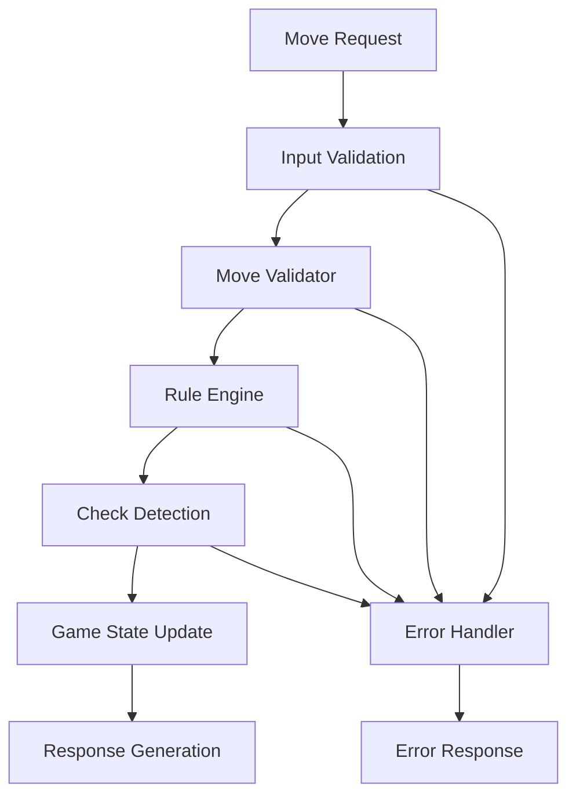
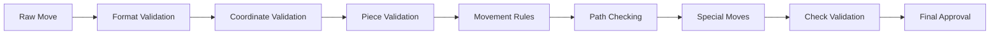

# Design Document

## Overview

The Chess Game Logic Validation system will enhance the existing WebChess implementation by adding comprehensive validation layers, robust error handling, and advanced rule enforcement. The design focuses on creating a bulletproof chess engine that ensures 100% compliance with FIDE rules while maintaining the existing API structure and performance characteristics.

The system will be built as an enhancement to the existing `ChessGame` class, adding validation layers, comprehensive test coverage, and edge case handling without breaking existing functionality.

## Architecture

### Core Components

1. **Enhanced ChessGame Class** - Extended validation and rule enforcement
2. **Move Validator** - Comprehensive move validation system
3. **Rule Engine** - FIDE-compliant rule implementation
4. **Game State Manager** - Robust state tracking and consistency
5. **Test Suite** - Comprehensive test coverage for all scenarios
6. **Error Handler** - Graceful error handling and user feedback

### System Flow



### Validation Pipeline



## Components and Interfaces

### Enhanced ChessGame Class

```javascript
class ChessGame {
  // Existing methods enhanced with validation
  makeMove(move) {
    const validation = this.validateMove(move);
    if (!validation.isValid) {
      return { success: false, message: validation.message, errors: validation.errors };
    }
    // Execute move with enhanced state tracking
  }
  
  // New validation methods
  validateMove(move) { /* Comprehensive validation */ }
  validateMoveFormat(move) { /* Input format validation */ }
  validateCoordinates(from, to) { /* Coordinate bounds checking */ }
  validatePieceOwnership(piece, color) { /* Piece ownership validation */ }
  validateMovementPattern(from, to, piece) { /* Piece-specific movement rules */ }
  validatePathClear(from, to) { /* Path obstruction checking */ }
  validateSpecialMoves(from, to, piece) { /* Castling, en passant, promotion */ }
  validateCheckConstraints(from, to, color) { /* Check/checkmate validation */ }
}
```

### Move Validator

```javascript
class MoveValidator {
  constructor(chessGame) {
    this.game = chessGame;
    this.ruleEngine = new RuleEngine();
  }
  
  validate(move) {
    const validations = [
      this.validateFormat(move),
      this.validateCoordinates(move),
      this.validatePiece(move),
      this.validateMovement(move),
      this.validatePath(move),
      this.validateSpecialRules(move),
      this.validateGameState(move)
    ];
    
    return this.combineValidations(validations);
  }
  
  validateFormat(move) { /* Input format validation */ }
  validateCoordinates(move) { /* Coordinate validation */ }
  validatePiece(move) { /* Piece existence and ownership */ }
  validateMovement(move) { /* Movement pattern validation */ }
  validatePath(move) { /* Path obstruction validation */ }
  validateSpecialRules(move) { /* Special move validation */ }
  validateGameState(move) { /* Game state consistency */ }
}
```

### Rule Engine

```javascript
class RuleEngine {
  // Piece movement rules
  validatePawnMove(from, to, piece, board) { /* FIDE pawn rules */ }
  validateRookMove(from, to, board) { /* FIDE rook rules */ }
  validateKnightMove(from, to) { /* FIDE knight rules */ }
  validateBishopMove(from, to, board) { /* FIDE bishop rules */ }
  validateQueenMove(from, to, board) { /* FIDE queen rules */ }
  validateKingMove(from, to, piece, gameState) { /* FIDE king rules */ }
  
  // Special move rules
  validateCastling(from, to, color, gameState) { /* FIDE castling rules */ }
  validateEnPassant(from, to, gameState) { /* FIDE en passant rules */ }
  validatePromotion(from, to, promotion) { /* FIDE promotion rules */ }
  
  // Game state rules
  validateCheck(color, board) { /* Check detection */ }
  validateCheckmate(color, gameState) { /* Checkmate detection */ }
  validateStalemate(color, gameState) { /* Stalemate detection */ }
  validateDraw(gameState) { /* Draw condition detection */ }
}
```

### Game State Manager

```javascript
class GameStateManager {
  constructor() {
    this.stateHistory = [];
    this.currentState = null;
  }
  
  updateState(move, previousState) {
    const newState = this.calculateNewState(move, previousState);
    this.validateStateConsistency(newState);
    this.stateHistory.push(newState);
    this.currentState = newState;
    return newState;
  }
  
  validateStateConsistency(state) { /* State validation */ }
  detectThreefoldRepetition() { /* Repetition detection */ }
  trackFiftyMoveRule() { /* Fifty-move rule tracking */ }
  updateCastlingRights(move, state) { /* Castling rights management */ }
  updateEnPassantTarget(move, state) { /* En passant target tracking */ }
}
```

## Data Models

### Enhanced Move Structure

```javascript
const move = {
  from: { row: number, col: number },
  to: { row: number, col: number },
  piece: string,
  color: string,
  promotion: string | null,
  isCapture: boolean,
  isCastling: boolean,
  isEnPassant: boolean,
  timestamp: number,
  validation: {
    isValid: boolean,
    errors: string[],
    warnings: string[]
  }
};
```

### Enhanced Game State

```javascript
const gameState = {
  board: Array<Array<Piece | null>>,
  currentTurn: 'white' | 'black',
  status: 'active' | 'check' | 'checkmate' | 'stalemate' | 'draw',
  winner: 'white' | 'black' | null,
  moveHistory: Move[],
  castlingRights: {
    white: { kingside: boolean, queenside: boolean },
    black: { kingside: boolean, queenside: boolean }
  },
  enPassantTarget: { row: number, col: number } | null,
  halfMoveClock: number,
  fullMoveNumber: number,
  positionHistory: string[],
  lastMove: Move | null,
  inCheck: boolean,
  availableMoves: Move[],
  metadata: {
    startTime: number,
    lastMoveTime: number,
    totalMoves: number
  }
};
```

### Validation Result Structure

```javascript
const validationResult = {
  isValid: boolean,
  message: string,
  errors: string[],
  warnings: string[],
  details: {
    formatValid: boolean,
    coordinatesValid: boolean,
    pieceValid: boolean,
    movementValid: boolean,
    pathValid: boolean,
    specialRulesValid: boolean,
    checkValid: boolean
  }
};
```

## Error Handling

### Error Categories

1. **Format Errors** - Invalid input format or structure
2. **Coordinate Errors** - Out-of-bounds or invalid coordinates
3. **Piece Errors** - Missing piece, wrong color, invalid piece type
4. **Movement Errors** - Invalid movement pattern for piece type
5. **Path Errors** - Blocked path or invalid path calculation
6. **Rule Errors** - Violation of chess rules (castling, en passant, etc.)
7. **State Errors** - Invalid game state or inconsistent state
8. **Check Errors** - Move puts own king in check or doesn't resolve check

### Error Response Structure

```javascript
const errorResponse = {
  success: false,
  message: string,
  errorCode: string,
  errors: string[],
  suggestions: string[],
  debugInfo: object | null
};
```

### Error Handling Strategy

- **Graceful Degradation** - System continues to function with reduced capabilities
- **Clear Messaging** - User-friendly error messages with actionable feedback
- **Logging** - Comprehensive error logging for debugging
- **Recovery** - Automatic recovery from transient errors where possible

## Testing Strategy

### Test Categories

1. **Unit Tests** - Individual method and function testing
2. **Integration Tests** - Component interaction testing
3. **Rule Compliance Tests** - FIDE rule validation testing
4. **Edge Case Tests** - Boundary condition and error scenario testing
5. **Performance Tests** - Move validation performance testing
6. **Regression Tests** - Existing functionality preservation testing

### Test Coverage Requirements

- **Minimum 95% code coverage** for chess game logic
- **100% coverage** for critical paths (move validation, check detection)
- **Comprehensive edge case coverage** for all identified scenarios
- **Performance benchmarks** for move validation timing

### Test Structure

```javascript
describe('Chess Game Logic Validation', () => {
  describe('Move Validation', () => {
    describe('Pawn Moves', () => {
      test('should validate basic pawn forward move');
      test('should validate pawn initial two-square move');
      test('should validate pawn diagonal capture');
      test('should validate en passant capture');
      test('should validate pawn promotion');
      test('should reject invalid pawn moves');
    });
    
    describe('Special Moves', () => {
      test('should validate kingside castling');
      test('should validate queenside castling');
      test('should reject castling through check');
      test('should reject castling with moved pieces');
    });
    
    describe('Check and Checkmate', () => {
      test('should detect check correctly');
      test('should prevent moves that put own king in check');
      test('should detect checkmate scenarios');
      test('should detect stalemate scenarios');
    });
  });
});
```

### Performance Testing

- **Move validation timing** - Target < 10ms per move validation
- **Game state updates** - Target < 5ms per state update
- **Check detection** - Target < 15ms per check calculation
- **Memory usage** - Monitor for memory leaks in long games

### Automated Testing Pipeline

- **Pre-commit hooks** - Run critical tests before code commits
- **Continuous integration** - Full test suite on every push
- **Performance regression detection** - Alert on performance degradation
- **Coverage reporting** - Track and maintain coverage metrics

## Implementation Phases

### Phase 1: Core Validation Enhancement
- Enhance existing move validation methods
- Add comprehensive input validation
- Implement detailed error reporting
- Create basic test framework

### Phase 2: Rule Engine Implementation
- Implement FIDE-compliant rule engine
- Add special move validation (castling, en passant, promotion)
- Enhance check and checkmate detection
- Add comprehensive rule testing

### Phase 3: Advanced Features
- Implement draw condition detection
- Add position history tracking
- Implement threefold repetition detection
- Add fifty-move rule tracking

### Phase 4: Testing and Optimization
- Achieve 95% test coverage
- Performance optimization
- Edge case testing
- Integration testing with existing system

This design ensures that the chess game logic validation system will be robust, comprehensive, and maintainable while preserving the existing API and functionality.