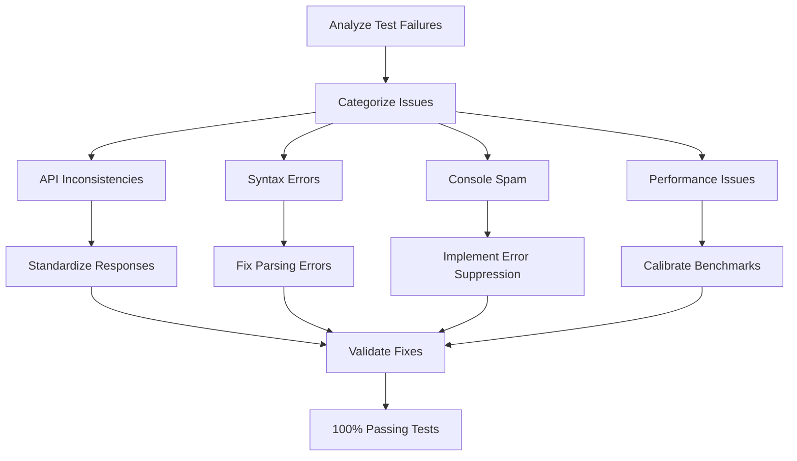
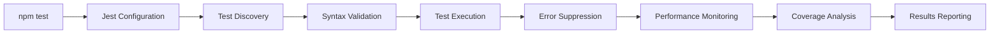

# Design Document

## Overview

The Test Infrastructure Refactoring system will systematically address all failing tests in the WebChess Jest test suite to achieve 100% passing tests. The design focuses on identifying and fixing API inconsistencies, resolving syntax errors, suppressing console error spam from error recovery tests, adjusting performance test expectations, and standardizing test patterns across the entire codebase.

The refactoring will maintain all existing functionality while ensuring tests accurately reflect the current implementation and provide reliable validation for continuous integration.

## Architecture

### Core Components

1. **API Response Standardization** - Ensure consistent response structures across all game methods
2. **Test File Syntax Repair** - Fix all parsing errors and syntax issues
3. **Console Error Management** - Implement proper error suppression for expected error conditions
4. **Performance Test Calibration** - Adjust performance expectations to realistic thresholds
5. **Test Pattern Standardization** - Implement consistent test structure and naming conventions
6. **Coverage Validation** - Ensure comprehensive test coverage with proper reporting

### Refactoring Strategy



### Test Execution Flow



## Components and Interfaces

### API Response Standardization

```javascript
// Standardized response structure for all game methods
const standardResponse = {
  success: boolean,
  data?: any,
  message?: string,
  errorCode?: string,
  errors?: string[],
  warnings?: string[]
};

// Game state property mapping
const gameStateMapping = {
  // Current inconsistencies to fix:
  'gameStatus' -> 'status',
  'moveHistory' -> consistent move object structure,
  'castlingRights' -> consistent across all methods,
  'enPassantTarget' -> consistent null/object handling
};
```

### Console Error Management

```javascript
// Error suppression utilities for tests
class TestErrorSuppression {
  constructor() {
    this.originalConsoleError = console.error;
    this.suppressedErrors = [];
  }
  
  suppressExpectedErrors(expectedPatterns) {
    console.error = (message, ...args) => {
      const fullMessage = [message, ...args].join(' ');
      const isExpected = expectedPatterns.some(pattern => 
        fullMessage.match(pattern)
      );
      
      if (!isExpected) {
        this.originalConsoleError(message, ...args);
      } else {
        this.suppressedErrors.push(fullMessage);
      }
    };
  }
  
  restoreConsoleError() {
    console.error = this.originalConsoleError;
  }
  
  getSuppressedErrors() {
    return this.suppressedErrors;
  }
}
```

### Performance Test Calibration

```javascript
// Realistic performance thresholds
const performanceThresholds = {
  moveValidation: {
    simple: 10, // ms per move
    complex: 50, // ms per complex position
    average: 5   // ms average across many moves
  },
  gameStateUpdate: {
    standard: 15, // ms per update
    withHistory: 25 // ms with full history tracking
  },
  checkDetection: {
    simple: 20, // ms for basic check detection
    complex: 100 // ms for complex positions
  },
  concurrentGames: {
    maxDuration: 5000, // ms for multiple concurrent games
    memoryGrowth: 50   // MB maximum memory growth
  }
};
```

### Test Pattern Standardization

```javascript
// Standardized test structure template
describe('ComponentName', () => {
  let instance;
  let errorSuppression;

  beforeEach(() => {
    instance = new ComponentName();
    errorSuppression = new TestErrorSuppression();
  });

  afterEach(() => {
    if (errorSuppression) {
      errorSuppression.restoreConsoleError();
    }
  });

  describe('methodName', () => {
    test('should handle valid input correctly', () => {
      // Arrange
      const input = createValidInput();
      
      // Act
      const result = instance.methodName(input);
      
      // Assert
      expect(result.success).toBe(true);
      expect(result.data).toBeDefined();
    });

    test('should handle invalid input gracefully', () => {
      // Arrange
      const input = createInvalidInput();
      errorSuppression.suppressExpectedErrors([/expected error pattern/]);
      
      // Act
      const result = instance.methodName(input);
      
      // Assert
      expect(result.success).toBe(false);
      expect(result.errorCode).toBeDefined();
    });
  });
});
```

## Data Models

### Test Failure Analysis Structure

```javascript
const testFailureAnalysis = {
  totalTests: number,
  failedTests: number,
  passingTests: number,
  failureCategories: {
    apiInconsistencies: {
      count: number,
      examples: string[],
      affectedFiles: string[]
    },
    syntaxErrors: {
      count: number,
      examples: string[],
      affectedFiles: string[]
    },
    consoleSpam: {
      count: number,
      examples: string[],
      affectedFiles: string[]
    },
    performanceIssues: {
      count: number,
      examples: string[],
      affectedFiles: string[]
    },
    otherIssues: {
      count: number,
      examples: string[],
      affectedFiles: string[]
    }
  }
};
```

### Standardized Move Response

```javascript
const moveResponse = {
  success: boolean,
  data: {
    move: {
      from: { row: number, col: number },
      to: { row: number, col: number },
      piece: string,
      color: string,
      captured: string | null,
      promotion: string | null,
      castling: string | null,
      enPassant: boolean
    },
    gameState: {
      status: string, // 'active' | 'check' | 'checkmate' | 'stalemate' | 'draw'
      currentTurn: string,
      winner: string | null,
      inCheck: boolean,
      moveHistory: Move[],
      castlingRights: CastlingRights,
      enPassantTarget: Position | null
    }
  },
  message?: string,
  errorCode?: string
};
```

### Test Coverage Requirements

```javascript
const coverageRequirements = {
  statements: 95,
  branches: 90,
  functions: 95,
  lines: 95,
  excludePatterns: [
    'tests/**',
    'coverage/**',
    'node_modules/**',
    '*.config.js'
  ],
  enforceThresholds: true,
  failOnLowCoverage: true
};
```

## Error Handling

### Test Error Categories

1. **API Inconsistency Errors** - Response structure mismatches
2. **Syntax Parsing Errors** - JavaScript parsing failures
3. **Console Spam Errors** - Excessive error output during testing
4. **Performance Threshold Errors** - Unrealistic timing expectations
5. **Coverage Validation Errors** - Insufficient test coverage
6. **Test Structure Errors** - Inconsistent test patterns

### Error Resolution Strategy

```javascript
const errorResolutionStrategy = {
  apiInconsistencies: {
    detection: 'Analyze failed assertions for response structure',
    resolution: 'Standardize all game method responses',
    validation: 'Verify consistent API across all methods'
  },
  syntaxErrors: {
    detection: 'Jest parsing error messages',
    resolution: 'Fix JavaScript syntax and imports',
    validation: 'Successful Jest file parsing'
  },
  consoleSpam: {
    detection: 'Excessive console.error output during tests',
    resolution: 'Implement selective error suppression',
    validation: 'Clean test output with expected errors suppressed'
  },
  performanceIssues: {
    detection: 'Performance test failures and timeouts',
    resolution: 'Calibrate realistic performance thresholds',
    validation: 'Consistent performance test passing'
  }
};
```

## Testing Strategy

### Test Refactoring Phases

1. **Analysis Phase** - Categorize all test failures
2. **API Standardization Phase** - Fix response structure inconsistencies
3. **Syntax Repair Phase** - Resolve all parsing errors
4. **Error Management Phase** - Implement console error suppression
5. **Performance Calibration Phase** - Adjust performance expectations
6. **Validation Phase** - Ensure 100% passing tests

### Test File Organization

```
tests/
├── unit/                    # Unit tests for individual components
│   ├── chessGame.test.js   # Core game logic tests
│   ├── gameState.test.js   # Game state management tests
│   └── errorHandler.test.js # Error handling tests
├── integration/             # Integration tests
│   ├── gameFlow.test.js    # Complete game flow tests
│   └── multiplayer.test.js # Multiplayer functionality tests
├── performance/             # Performance and load tests
│   ├── moveValidation.test.js
│   └── concurrentGames.test.js
├── helpers/                 # Test utilities and helpers
│   ├── testData.js         # Common test data and positions
│   ├── errorSuppression.js # Error suppression utilities
│   └── performanceUtils.js # Performance testing utilities
└── setup.js                # Global test setup and configuration
```

### Test Execution Strategy

```javascript
// Jest configuration for reliable test execution
const jestConfig = {
  testEnvironment: 'node',
  setupFilesAfterEnv: ['<rootDir>/tests/setup.js'],
  collectCoverageFrom: [
    'src/**/*.js',
    '!src/**/*.test.js',
    '!coverage/**',
    '!node_modules/**'
  ],
  coverageThreshold: {
    global: {
      statements: 95,
      branches: 90,
      functions: 95,
      lines: 95
    }
  },
  testTimeout: 30000, // 30 seconds for complex tests
  maxWorkers: '50%',  // Prevent resource exhaustion
  verbose: true,
  bail: false // Continue running all tests even after failures
};
```

## Implementation Phases

### Phase 1: Test Failure Analysis and Categorization
- Run comprehensive test analysis to categorize all 145 failures
- Create detailed mapping of API inconsistencies
- Identify all syntax errors and parsing issues
- Document console error spam sources
- Analyze performance test failure patterns

### Phase 2: API Response Standardization
- Standardize all game method response structures
- Fix property naming inconsistencies (status vs gameStatus)
- Ensure consistent error response formats
- Update move history and game state structures
- Validate API consistency across all methods

### Phase 3: Syntax Error Resolution
- Fix all JavaScript parsing errors in test files
- Resolve ES6+ syntax issues and import problems
- Clean up malformed test structures
- Ensure proper Jest configuration for all file types
- Eliminate worker process exceptions

### Phase 4: Console Error Management
- Implement selective error suppression for error recovery tests
- Create test utilities for managing expected errors
- Separate intentional errors from actual test failures
- Clean up test output for better readability
- Maintain error validation without console spam

### Phase 5: Performance Test Calibration
- Analyze current performance test failures
- Set realistic performance thresholds for different environments
- Implement proper performance measurement techniques
- Account for system variability in CI/CD environments
- Create performance benchmarks that are achievable and meaningful

### Phase 6: Final Validation and Optimization
- Achieve 100% passing tests across all test suites
- Validate test coverage meets 95% threshold
- Ensure consistent test execution across environments
- Optimize test execution time and resource usage
- Document test patterns and maintenance procedures

This design ensures that the test infrastructure refactoring will systematically address all test failures while maintaining code quality and providing a reliable foundation for continuous integration and development.