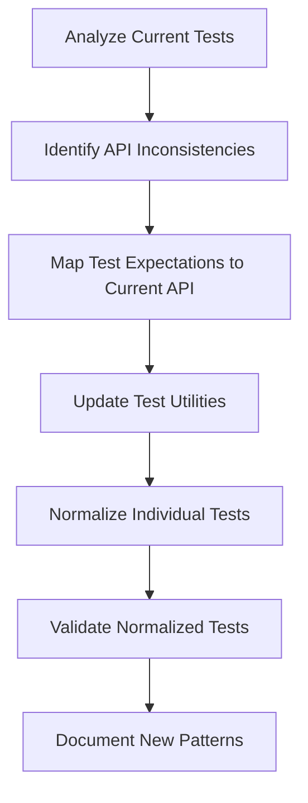

# Design Document

## Overview

The Unit Test API Normalization system will systematically update all 54+ test units across the WebChess test suite to use consistent, current API patterns. The design focuses on identifying API inconsistencies between test expectations and the current implementation, then normalizing all tests to use the standardized response structures, method signatures, and property names as implemented in the current codebase.

The normalization will ensure that every test accurately validates the current implementation while maintaining comprehensive test coverage and following established testing patterns.

## Architecture

### Current API Analysis

Based on analysis of the current implementation, the standardized API patterns are:

#### Response Structure Pattern
```javascript
// Success Response (from errorHandler.createSuccess)
{
  success: true,
  message: string,
  data: object,
  metadata?: object
}

// Error Response (from errorHandler.createError)
{
  success: false,
  message: string,
  code: string,
  details?: object,
  errors?: string[]
}
```

#### Game State Properties
```javascript
// Current implementation uses these property names:
{
  board: Piece[][],
  currentTurn: 'white' | 'black',
  gameStatus: 'active' | 'check' | 'checkmate' | 'stalemate' | 'draw',
  winner: 'white' | 'black' | null,
  moveHistory: MoveRecord[],
  castlingRights: CastlingRights,
  enPassantTarget: Position | null,
  inCheck: boolean,
  checkDetails: object | null
}
```

#### Move API Pattern
```javascript
// Current makeMove method signature:
makeMove(move) // where move = { from: {row, col}, to: {row, col}, promotion?: string }
// OR
makeMove(from, to, promotion) // legacy support

// Returns standardized response structure
```

### Normalization Strategy



### Test File Categories

1. **Core Game Logic Tests** - Basic game mechanics and state management
2. **Piece Movement Tests** - Individual piece movement validation
3. **Special Move Tests** - Castling, en passant, promotion
4. **Game State Tests** - State transitions and validation
5. **Error Handling Tests** - Invalid input and error response validation
6. **Integration Tests** - Complete game flow scenarios

## Components and Interfaces

### Test Utility Normalization

#### Current testUtils Issues
Based on test file analysis, current testUtils functions expect different API patterns than the implementation provides:

```javascript
// Issues identified:
// 1. testUtils.validateSuccessResponse() expects different response structure
// 2. testUtils.createFreshGame() may not initialize correctly
// 3. testUtils.validateGameState() checks wrong property names
// 4. testUtils.ExecutionHelpers.testMove() expects different response format
```

#### Normalized Test Utilities
```javascript
const testUtils = {
  // Game Creation
  createFreshGame() {
    return new ChessGame(); // Use current constructor
  },

  // Response Validation
  validateSuccessResponse(result) {
    expect(result.success).toBe(true);
    expect(result.message).toBeDefined();
    expect(result.data).toBeDefined();
  },

  validateErrorResponse(result, expectedCode) {
    expect(result.success).toBe(false);
    expect(result.message).toBeDefined();
    expect(result.code).toBe(expectedCode);
  },

  // Game State Validation
  validateGameState(gameState) {
    expect(gameState).toHaveProperty('board');
    expect(gameState).toHaveProperty('currentTurn');
    expect(gameState).toHaveProperty('gameStatus'); // NOT 'status'
    expect(gameState).toHaveProperty('winner');
    expect(gameState).toHaveProperty('moveHistory');
    expect(gameState).toHaveProperty('castlingRights');
    expect(gameState).toHaveProperty('enPassantTarget');
  },

  // Board Position Validation
  validateBoardPosition(board, row, col, expectedPiece) {
    if (expectedPiece === null) {
      expect(board[row][col]).toBeNull();
    } else {
      expect(board[row][col]).toEqual(expectedPiece);
    }
  },

  // Move Execution Helpers
  ExecutionHelpers: {
    testMove(game, move, shouldSucceed, expectedErrorCode = null) {
      const result = game.makeMove(move);
      
      if (shouldSucceed) {
        testUtils.validateSuccessResponse(result);
      } else {
        testUtils.validateErrorResponse(result, expectedErrorCode);
      }
      
      return result;
    },

    executeMovesSequence(game, moves) {
      moves.forEach(move => {
        const result = game.makeMove(move);
        expect(result.success).toBe(true);
      });
    }
  }
};
```

### API Mapping Strategy

#### Property Name Mapping
```javascript
const propertyMapping = {
  // Tests expecting 'status' should use 'gameStatus'
  'status' -> 'gameStatus',
  
  // Tests expecting different response structures
  'isValid' -> 'success',
  'error' -> 'message',
  'errorCode' -> 'code'
};
```

#### Method Call Normalization
```javascript
// Current patterns to normalize:
// 1. Direct property access: game.status -> game.gameStatus
// 2. Method calls: game.isValidMove() -> game.makeMove() with validation
// 3. Response validation: result.isValid -> result.success
```

### Error Code Standardization

#### Current Error Codes (from errorHandler.js)
```javascript
const standardErrorCodes = {
  'MALFORMED_MOVE': 'Move format is incorrect',
  'INVALID_COORDINATES': 'Invalid board coordinates',
  'GAME_NOT_ACTIVE': 'Game is not active',
  'NO_PIECE': 'No piece at source square',
  'WRONG_TURN': 'Not your turn',
  'INVALID_MOVEMENT': 'Invalid piece movement',
  'PATH_BLOCKED': 'Path is blocked',
  'CAPTURE_OWN_PIECE': 'Cannot capture own piece',
  'INVALID_CASTLING': 'Castling not allowed',
  'INVALID_PROMOTION': 'Invalid promotion piece',
  'KING_IN_CHECK': 'Move would put king in check',
  'CHECK_NOT_RESOLVED': 'Move does not resolve check'
};
```

## Data Models

### Test Normalization Mapping

```javascript
const testNormalizationMap = {
  // Response structure updates
  responseValidation: {
    oldPattern: 'expect(result.isValid).toBe(true)',
    newPattern: 'expect(result.success).toBe(true)'
  },
  
  // Property access updates
  propertyAccess: {
    'game.status': 'game.gameStatus',
    'gameState.status': 'gameState.gameStatus',
    'result.error': 'result.message',
    'result.errorCode': 'result.code'
  },
  
  // Method call updates
  methodCalls: {
    'game.isValidMove(move)': 'game.makeMove(move).success',
    'game.getStatus()': 'game.gameStatus',
    'game.getCurrentTurn()': 'game.currentTurn'
  }
};
```

### Test File Analysis Structure

```javascript
const testFileAnalysis = {
  fileName: string,
  totalTests: number,
  issuesFound: {
    apiInconsistencies: {
      count: number,
      examples: string[],
      lineNumbers: number[]
    },
    propertyNameIssues: {
      count: number,
      examples: string[],
      lineNumbers: number[]
    },
    responseFormatIssues: {
      count: number,
      examples: string[],
      lineNumbers: number[]
    },
    utilityFunctionIssues: {
      count: number,
      examples: string[],
      lineNumbers: number[]
    }
  },
  normalizationPlan: {
    updates: string[],
    priority: 'high' | 'medium' | 'low'
  }
};
```

### Standardized Test Patterns

#### Move Validation Test Pattern
```javascript
describe('Piece Movement', () => {
  let game;

  beforeEach(() => {
    game = new ChessGame(); // Direct constructor call
  });

  test('should allow valid move', () => {
    const move = { from: { row: 6, col: 4 }, to: { row: 5, col: 4 } };
    const result = game.makeMove(move);
    
    expect(result.success).toBe(true);
    expect(result.data).toBeDefined();
    expect(game.currentTurn).toBe('black'); // Use actual property name
    expect(game.gameStatus).toBe('active'); // Use actual property name
  });

  test('should reject invalid move', () => {
    const move = { from: { row: 6, col: 4 }, to: { row: 3, col: 4 } }; // Invalid pawn move
    const result = game.makeMove(move);
    
    expect(result.success).toBe(false);
    expect(result.code).toBe('INVALID_MOVEMENT');
    expect(result.message).toContain('cannot move');
  });
});
```

#### Game State Validation Pattern
```javascript
test('should maintain correct game state', () => {
  const move = { from: { row: 6, col: 4 }, to: { row: 5, col: 4 } };
  const result = game.makeMove(move);
  
  expect(result.success).toBe(true);
  
  // Validate current implementation properties
  expect(game.currentTurn).toBe('black');
  expect(game.gameStatus).toBe('active');
  expect(game.moveHistory).toHaveLength(1);
  expect(game.board[5][4]).toEqual({ type: 'pawn', color: 'white' });
  expect(game.board[6][4]).toBeNull();
});
```

## Error Handling

### Test Error Categories

1. **API Inconsistency Errors** - Tests expecting different response structures
2. **Property Name Errors** - Tests accessing non-existent properties
3. **Method Signature Errors** - Tests calling methods with wrong parameters
4. **Response Validation Errors** - Tests validating wrong response format
5. **Utility Function Errors** - Test utilities using outdated patterns

### Error Resolution Strategy

```javascript
const errorResolutionStrategy = {
  apiInconsistencies: {
    detection: 'Scan for result.isValid, result.error patterns',
    resolution: 'Update to result.success, result.message patterns',
    validation: 'Verify tests pass with current API'
  },
  
  propertyNameErrors: {
    detection: 'Scan for game.status, gameState.status patterns',
    resolution: 'Update to game.gameStatus, gameState.gameStatus',
    validation: 'Verify property access matches implementation'
  },
  
  methodSignatureErrors: {
    detection: 'Scan for deprecated method calls',
    resolution: 'Update to current method signatures',
    validation: 'Verify method calls work with current implementation'
  }
};
```

## Testing Strategy

### Normalization Phases

1. **Analysis Phase** - Identify all API inconsistencies across test files
2. **Utility Update Phase** - Normalize test utility functions first
3. **Individual Test Update Phase** - Update each test file systematically
4. **Validation Phase** - Ensure all tests pass with current implementation
5. **Documentation Phase** - Document new patterns for future development

### Test File Processing Order

```javascript
const processingOrder = [
  // Core utilities first
  'tests/setup.js',
  
  // Core game logic tests
  'tests/chessGame.test.js',
  'tests/gameStateManagement.test.js',
  
  // Piece movement tests
  'tests/pawnMovement.test.js',
  'tests/knightMovement.test.js',
  'tests/rookMovement.test.js',
  'tests/bishopMovement.test.js',
  'tests/queenMovement.test.js',
  'tests/kingMovement.test.js',
  
  // Special move tests
  'tests/castlingValidation.test.js',
  'tests/specialMovesComprehensive.test.js',
  
  // Game state tests
  'tests/checkDetection.test.js',
  'tests/checkmateDetection.test.js',
  'tests/stalemateDetection.test.js',
  
  // Error handling tests
  'tests/errorHandlingComprehensive.test.js',
  'tests/invalidInputHandling.test.js',
  
  // Integration tests
  'tests/gameFlow.test.js',
  'tests/integrationTests.test.js'
];
```

### Validation Strategy

```javascript
const validationStrategy = {
  // Pre-normalization validation
  preNormalization: {
    runTests: 'npm test',
    captureFailures: 'Document current failure patterns',
    analyzeErrors: 'Categorize API inconsistency types'
  },
  
  // Post-normalization validation
  postNormalization: {
    runTests: 'npm test',
    verifyPassing: 'All tests should pass',
    validateCoverage: 'Maintain or improve test coverage',
    checkConsistency: 'Verify consistent API usage patterns'
  }
};
```

## Implementation Phases

### Phase 1: Comprehensive Test Analysis
- Analyze all 54+ test units to identify API inconsistencies
- Create detailed mapping of current vs expected API patterns
- Document all property name mismatches and method signature issues
- Categorize tests by type and complexity of required changes

### Phase 2: Test Utility Normalization
- Update testUtils functions to use current API patterns
- Normalize response validation functions
- Update game creation and setup utilities
- Standardize assertion patterns and helper functions

### Phase 3: Core Game Logic Test Updates
- Normalize chessGame.test.js to use current API
- Update game state validation tests
- Fix property access patterns (status -> gameStatus)
- Standardize move validation test patterns

### Phase 4: Piece Movement Test Normalization
- Update all piece-specific movement tests
- Normalize move execution and validation patterns
- Standardize error handling expectations
- Ensure consistent test structure across all piece tests

### Phase 5: Special Move Test Updates
- Normalize castling validation tests
- Update en passant test patterns
- Fix pawn promotion test expectations
- Standardize special move error handling

### Phase 6: Game State and Error Handling Tests
- Update check/checkmate/stalemate detection tests
- Normalize error handling test expectations
- Fix invalid input handling test patterns
- Standardize game state transition tests

### Phase 7: Integration and Comprehensive Tests
- Update game flow integration tests
- Normalize comprehensive test suites
- Fix performance test expectations
- Standardize browser compatibility tests

### Phase 8: Final Validation and Documentation
- Run complete test suite to ensure 100% passing
- Validate test coverage maintains or improves
- Document new test patterns for future development
- Create migration guide for future API changes

This design ensures that all unit tests will be systematically normalized to use the current internal API consistently, providing reliable validation of the current implementation while maintaining comprehensive test coverage.