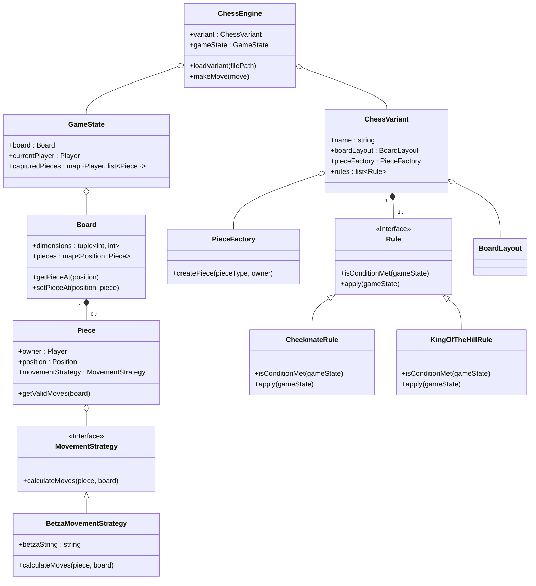

# CHESS VARIANT SUPPORT ROADMAP

## Introduction

This document specifies the requirements for a chess engine to support a wide variety of chess variants, including those with larger boards, non-standard pieces, and alternative rules. The goal is to create a flexible, data-driven architecture that can be easily extended to support new variants with minimal code changes. This roadmap is intended to be used by an AI/LLM agent to guide the implementation process.

## Glossary

- **Archbishop (Princess):** A fairy chess piece that combines the moves of a Bishop and a Knight.
- **Alternative Objective:** A winning condition other than the standard checkmate (e.g., reaching a specific rank, capturing all of a certain piece type).
- **Betza's Notation:** A compact, formal notation for describing how chess pieces move, capable of defining both standard and fairy chess pieces.
- **Chancellor (Empress):** A fairy chess piece that combines the moves of a Rook and a Knight.
- **Chess Variant:** A game derived from chess by making one or more changes to the board, setup, pieces, or rules.
- **EARS (Easy Approach to Requirements Syntax):** A structured syntax for writing textual requirements to reduce ambiguity.
- **Fairy Chess Piece:** A chess piece not used in conventional chess, with unique movement rules.
- **INCOSE (International Council on Systems Engineering):** A professional organization that sets standards and guides best practices for systems engineering.
- **Mermaid:** A Markdown-inspired syntax for generating diagrams (like flowcharts and class diagrams) from text.
- **Non-Standard Game Mechanic:** A fundamental rule alteration that goes beyond simple piece or board changes, such as hidden information (Fog of War) or simultaneous movement.
- **Piece-Drop Game:** A chess variant (e.g., Crazyhouse) where captured pieces are returned to the capturing player's "hand" and can be placed back on the board as their own.
- **Variant Configuration File:** An external, data-driven file (e.g., in JSON or YAML format) that defines the specific board, pieces, setup, and rules for a chess variant, allowing the engine to load it without requiring new code.

## Requirements

### Requirement 1: Data-Driven Variant Configuration

**User Story:** As a developer, I want to define new chess variants using external configuration files, so that I can add support for new games without modifying the core engine's source code.

#### Acceptance Criteria

1.  **WHEN** the engine starts, **THEN** it **SHALL** load chess variant definitions from a designated directory containing Variant Configuration Files.
2.  **WHILE** a Variant Configuration File is being parsed, **THE SYSTEM SHALL** validate it against a defined schema to ensure correctness.
3.  **IF** a Variant Configuration File is invalid, **THEN** the engine **SHALL** report an error detailing the validation failure and gracefully skip the invalid variant.
4.  **THE SYSTEM SHALL** support a flexible data format (e.g., JSON or YAML) for the Variant Configuration Files.

### Requirement 2: Flexible Board Representation

**User Story:** As a user, I want to play chess on boards of different sizes and shapes, so that I can experience a wide range of chess variants.

#### Acceptance Criteria

1.  **THE SYSTEM SHALL** support rectangular boards of any M x N dimension, as specified in the Variant Configuration File.
2.  **THE SYSTEM SHALL** be capable of representing non-rectangular board shapes, such as hexagonal grids, if defined in the variant's configuration.
3.  **WHEN** a game is initialized, **THEN** the board data structure **SHALL** be dynamically configured based on the dimensions and shape specified for the selected variant.
4.  **ALL** engine logic, including move generation and piece location, **SHALL** operate correctly with the dynamically configured board representation.

### Requirement 3: Abstract Piece Definition

**User Story:** As a variant creator, I want to define custom pieces with unique movement rules, so that I can implement fairy chess and other novel variants.

#### Acceptance Criteria

1.  **THE SYSTEM SHALL** define piece movements and capabilities based on rules provided in the Variant Configuration File, rather than hardcoding them.
2.  **THE SYSTEM SHALL** use a formal notation, such as Betza's Notation, to specify piece movement rules within the configuration files.
3.  **WHEN** parsing a Variant Configuration File, **THE ENGINE SHALL** dynamically generate movement logic for each piece based on its Betza's Notation string.
4.  **THE SYSTEM SHALL** support standard chess pieces (King, Queen, Rook, Bishop, Knight, Pawn) as default configurations using the same abstract definition system.

### Requirement 4: Configurable Game Objectives

**User Story:** As a player, I want to play variants with unique winning conditions, so that I can experience games beyond standard checkmate.

#### Acceptance Criteria

1.  **THE SYSTEM SHALL** support the definition of alternative game objectives in the Variant Configuration File.
2.  **WHILE** a game is in progress, **THE ENGINE SHALL** evaluate the game state against the configured objectives after each move.
3.  **SUPPORTED OBJECTIVES SHALL** include, but are not limited to:
    *   Standard checkmate.
    *   "King of the Hill": a player wins by moving their king to a designated central area.
    *   "Extinction": a player wins by capturing all of an opponent's pieces of a specific type (e.g., all pawns).
4.  **IF** a move results in a player meeting a configured winning condition, **THEN** the engine **SHALL** declare that player the winner and end the game.

### Requirement 5: Support for Piece Drops

**User Story:** As a player, I want to play "drop-in" variants like Crazyhouse, so that I can reintroduce captured pieces onto the board.

#### Acceptance Criteria

1.  **THE SYSTEM SHALL** be configurable to enable "piece drop" mechanics via the Variant Configuration File.
2.  **WHEN** a piece is captured in a piece-drop variant, **THEN** it **SHALL** be placed in the capturing player's "hand" or reserve.
3.  **A PLAYER SHALL** be able to use their turn to "drop" a piece from their hand onto any empty square on the board, subject to variant-specific restrictions.
4.  **THE ENGINE'S** move generation logic **SHALL** include drop moves as legal options when a player has pieces in their hand.

### Requirement 6: Support for Non-Standard Game Mechanics

**User Story:** As an advanced user, I want to play variants with unconventional rules like Fog of War, so that I can explore more exotic forms of chess.

#### Acceptance Criteria

1.  **THE SYSTEM SHALL** provide a modular architecture that allows for the implementation of non-standard game mechanics.
2.  **THE ENGINE SHALL** support a "Fog of War" or "Dark Chess" mechanic, where each player can only see squares their own pieces can legally move to.
3.  **WHEN** Fog of War is active, **THE SYSTEM SHALL** manage each player's partial view of the board and only reveal information as pieces move and attack.
4.  **THE ARCHITECTURE SHALL** be extensible to support other non-standard mechanics, such as simultaneous moves or hidden information, through well-defined interfaces.

## Technical Diagrams

### Proposed Class Structure

This diagram illustrates a high-level class structure for a flexible chess engine.



### Variant Configuration File Schema

This diagram shows a possible structure for a JSON/YAML configuration file.

```mermaid
graph TD
    A[Variant Configuration] --> B{Details};
    A --> C{Board};
    A --> D{Pieces};
    A --> E{Rules};

    B --> B1[Name: string];
    B --> B2[Description: string];

    C --> C1[Shape: string ("rectangular", "hexagonal")];
    C --> C2[Width: int];
    C --> C3[Height: int];

    D --> D1[Piece Definitions];
    D1 --> D2{...};
    D2 -- "e.g., 'Pawn'" --> D3{Movement: "mfWcfF"};
    D2 -- "e.g., 'Archbishop'" --> D4{Movement: "BN"};

    E --> E1[WinConditions: array];
    E1 --> E2["Checkmate"];
    E1 --> E3["KingOfTheHill"];
    E --> E4[DropRules: boolean];
```
